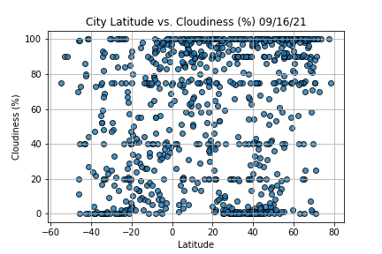

# Project: Weather_Analysis

# Project Owner: Jack

# Project Manager: Nayan Patel

# Project Overview: 

Jack who loves PlanMyTrip app. Well I love it too. And, as with any new product, stakeholders recommended a few changes to take the app to the next level. Specifically, they recommend adding the weather description to the weather data to filter the by weather preferences, which will be used to identify potential travel destinations and nearby hotels. From the list of potential travel destinations

## Project Deliverables:

Deliverable 1: Retrieve Weather Data

Deliverable 2: Create a Customer Travel Destinations Map

Deliverable 3: Create a Travel Itinerary Map

## Milestones:
1. To choose vacation destination cities to create a travel itinerary. 
2. Finally, using the Google Maps Directions API,and create a travel route between the destinations
3. Creating a marker layer map.

Here are some images that can visually describe the work done and How it will lokk like comapring to deliverables.

# 1. Retriving Weather data: Based on Temperature, Humidity, Cloudiness and Windspeed

a. Based on Temperature: 

 
b. Based on Humidity: 

c. Based on Cloudiness

d. Based on Windspeed

# 2. Creating a Customer Travel Destinations Map

# 3. Creating a Travel Itinerary Map

